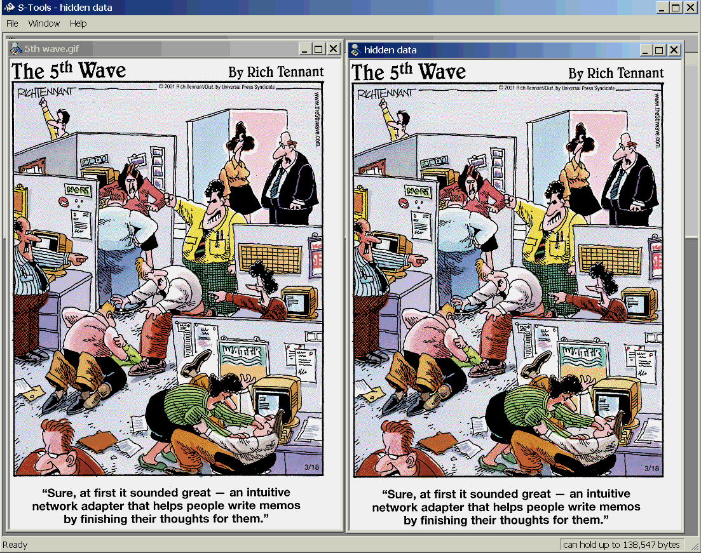
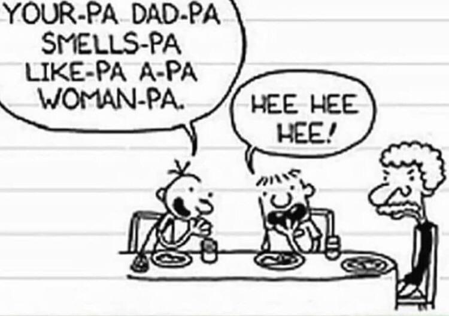
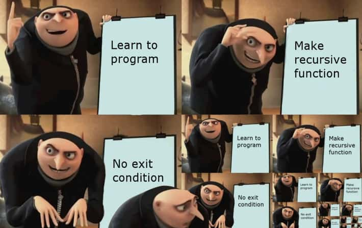
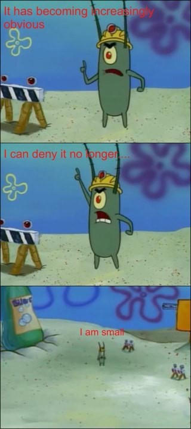
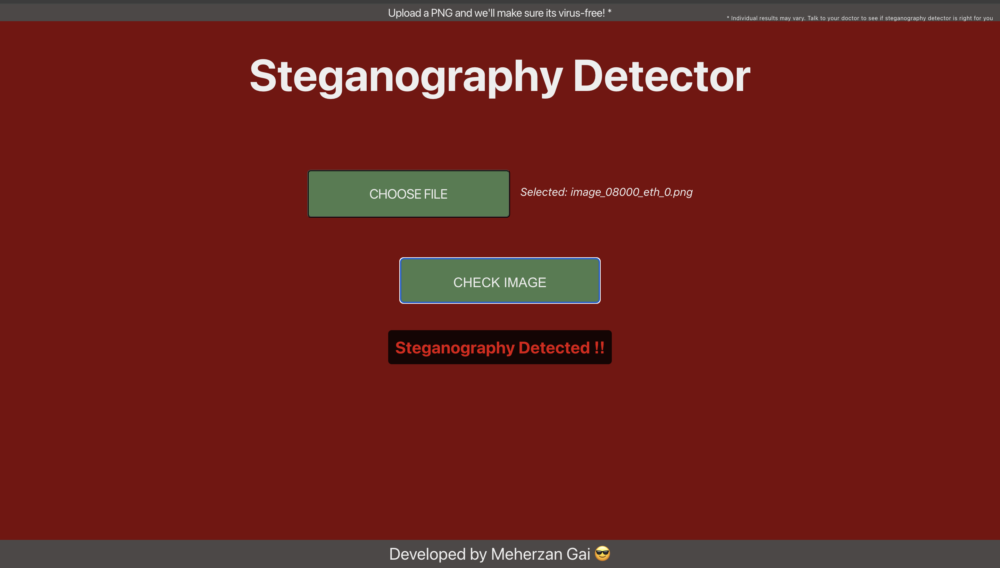

## Table of Contents

- [Table of Contents](#table-of-contents)
- [Introduction](#introduction)
- [Problem](#problem)
- [Data Collection](#data-collection)
- [Training](#training)
- [Testing](#testing)
- [Limitations](#limitations)
- [Issues and Future Steps](#issues-and-future-steps)
- [Front End Notes](#front-end-notes)
- [Installation instructions](#installation-instructions)
- [Side Notes and Acknowledgments](#side-notes-and-acknowledgments)

## Introduction
Steganography is an encryption technique in which the Least Significant Bits (LSBs) in a file are altered to encode characters. These characters may be a harmless message, but they could also be used to run a malicious payload on your computer.

While steganography is difficult to conceal in many file formats, it thrives 
in visuals and other forms of digital multimedia. 
Intuitively, changing the LSBs in media forms would create a much
less noticeable difference in the file's output compared to other file formats.

(It is in fact for this reason we use a different, "more-lossy", internet protocol
for media streaming called UDP)

Let's take a look at the following image:

Both cartoon depictions of an office look the same, however the one on the right
contains a secret message that has been encoded into the image using steganography
to alter the LSBs of the image file.

Now's the point in time where you might be thinking, "Wow this is so cool, I could use this to hide secret messages in images I send to my friends!"

... and yes...

you could
indeed have your own secret way of communicating with your besties using this
(and it would be far superior to whatever Greg and Rowley were trying to use here)

but this idea can also be used for some not so great stuff :\(

## Problem
In the past months, AI-powered steganography injection attacks have been rampant,
especially in images.
Hackers have been leveraging bots such as Duqu and Zbot which use AI to encode malicious Base 64 code in images.

The real danger of these attacks lies in its naiveté. Images are generally considered "trustworthy", "safe", and "not capable of causing a lot of damage". After all how much malicious code could possibly be in a tiny 100px by 100px image?
(The answer is enough to do a LOT of damage!)

Many antivirus solutions also overlook non-executable file formats such as images, 
which makes these attacks far more dangerous than other, "traditional" cyber attacks which antiviruses have an easier time identifying.

Finally, it is almost impossible to know you've downloaded and opened a 
hacked image just by looking at it. Many viruses make it clear that you've... well... done something not so great. 

Let's say you pirated a video game on your laptop and when you tried running it, 
you got error messages in Russian and now there's weird stuff going on with 
your laptop...

Yeah you're probably cooked at that point.

But what about steganographically injected images? Let's say my internet friend sent me this funny meme 

I could laugh my socks off for 20 minutes straight and nothing would happen at all...

I would have no way of knowing that me opening this image now just leaked my IP address, or did some sort of other malicious task, on my computer.

And even worse... let's say I'm one of **THOSE** people who forward memes to every
person in their contact list. Now I've just leaked my IP address as well as every single friend on my contact list's IP address to some random person on the internet...

(At least if we go down, we all go down together)

Jokes aside, it is for this reason that steganography is so dangerous.
Viruses could spreading from computer to computer, meme to meme, across the internet and we would have no way of knowing.

In fact, this is why cybersecurity experts have a hard time quantifying the number
of steganographyically injected forms of media there are on the internet.

The only way we could possibly know if there is malicious code in a piece of media, would be to look at the binary of it.

However, there's millions if not billions of media on the internet. And even if 
someone *was* willing to look at the binary of every single media form, it certainly is not feasible to try to have humans decrypt the least significant bytes (LSBs in case you forgot!) of media online to possibly
try and figure out if there is malicious code in it.

We need a quicker, faster, stronger, human (that we also don't have to pay) to 
analyze the LSBs of media forms and see if there is malicious code in them
(did someone say AI??? 👀)

Since images are the most common form of multimedia on the internet, and due to
their prevalent usage in AI steganography attacks, I will be addressing them in this project.

## Data Collection
For this project I downloaded a [Kaggle database](e.com/datasets/marcozuppelli/stegoimagesdataset/data?select=dataset_information.csv) containing 44,000 images,
with 36,000 of those images containing some sort of steganography injection.

I used the Pillow library to open and read the raw bytes of each image.

Performing a simple bitwise operation, I was able to get access to the least significant bit of every single byte in the image.

I then used numpy vector and array operations to convert the raw bits into sets of 8 so I could store them as bytes.

I then converted the bytes into a series of float values between 0.0 and 1.0
to be used for training the AI model.

## Training
For the training process, I utilized 1000 clean images, and 1000 images with steganography, taken from the "train" folder
of the dataset, shuffled together.

Using the data collection methods specified earlier, I converted the LSB's of these images to a series of float values for each image

I decided to use a sequential neural network model to train on these series of float values

While I have never worked with these before, using a sequential neural network model made intuitive sense to me as we are looking to analyze the patterns in
the sequence of bytes in the LSB to determine whether or not there is malicious payload.

I used the tensorflow library to train a sequential neural network model on the series of float values I got from each image's LSBs.

## Testing
For the testing process, I utilized a similar methodology as the training process, taking 1000 clean images, and 1000 images with steganography, from the "test" folder of the dataset, and seeing how accurately my model would predict whether these images had
or didn't have steganography in them.

## Limitations

The model ended up having an accuracy of roughly 75%. Not horrible for a first trial run. 

There are multiple limitations that play into this such as time and my own
inexperience, but perhaps the largest limitation is that I was running this on 
my laptop.

And while I do love my laptop very dearly, due to its physical limitations, I was only able to train on 2000 images, 1000 with steganography, and 1000 without steganography.

This is roughly 1/16 of the total training dataset provided by the kaggle database.

(My laptop throughout this project)

## Issues and Future Steps
Analyzing beyond just "not enough data". There are some issues with my program that need to be addressed in the next version.

1. **False Negatives**

    While my model has a high accuracy when it comes to detecting clean images from the dataset as clean. It overfits that to images with steganography in them, having somewhere around a 50% accuracy (yet to be tested extensively) for detecting steganography in images with it.

    This is not ideal as we would prefer our model to err on the side of caution as opposed to signaling the go-ahead-and-open flag to users despite their being malicious code in the images.

2. **Random images on the internet tend to be classified as having steganography**

    I'm not sure if this is because they actually have steganography in them (I would hope and assume not), but due to the "clean images" all coming from this dataset and not from random images online, it is definitely plausible that the model has not seen what other clean images can look like. 

In the future I plan to increase the dataset size to try to boost accuracy. Additionally, I will observe float value thresholds for predictions by my model and try to find the right threshold that will reduce false negatives and instead increase false positives (which are argubly less dangerous).

Finally, and most importantly, I will try to find a different dataset containing clean images from the internet so that my model can be exposed to other kinds of clean images and mitigate classifying random images as having steganography in them.

## Front End Notes
As part of the project, I created, with the help of ChatGPT to speed things up,
a front-end webpage for users to upload PNG files onto, and then see if their
image has steganography in it, or if its clean (according to my model).

Below is a little action shot of my webpage:

## Installation instructions

Unfortunately at this time, there are still difficulties on my end in uploading
the pickle file of the model.

However... in the meantime, the model pickle file can be generated. To do so:

1. Install dependencies in requirements.txt
2. Go to the detector.ipynb file and uncomment the first block (it should say run once on it)
3. Once your path is printed, update the basePath variable a couple blocks below 
    with your own path file to the cached data (there should be a comment showing
    where to update this)
4. Run the rest of the code blocks
5. You should have a pickle file named model.pkl
6. Note that you can adjust the array slicing where the comment says, in order to get less or more data for your model.

Once you have the model pickle file, you need to first run the app.py file using
**python3 app.py** in the terminal at the directory.

Then you need to cd into the steg-front-end directory using **cd steg-front-end**  and then use **npm start** in the terminal to run the front-end.

## Side Notes and Acknowledgments

1. **PNGs vs JPEGs**

    If you look up steganography regarding images, almost all of them talk about using them in PNGs and not JPEGs or JPGs.
    
    The reason for this is due to compression...

    PNGs are uncompressed files, whereas JPEGs and JPGs get compressed, which can result in "meaningless" data being lost.

    While for the user, that data is in most cases pretty meaningless,
    for hackers looking to use steganography, this essentially puts a roadblock in their plans.

    It is very difficult to know what will and won't be lost during compression, 
    and especially if you are dealing with "least-significant" bytes, there is a very good chance that part of the payload gets lost during compression
    resulting in an unsuccessful attack.

2. **Audio, Video, and other Multimedia**

    As mentioned earlier, steganography is used in many multimedia forms. This includes audio and video.

    While the current scope of this project deals with images due to the smaller byte size, and larger prevalence, I do plan to extend to audio sometime in the future.

3. Acknowledgments

    Okay.... this is the sappy part. I would first like to thank the organizers of 
    Bitcamp for this wonderful opportunity.

    I've never participated in a Bitcamp before so just getting this experience of 
    coding alongside hundreds of really talented peers while getting to attend workshops, watch people sumo wrestle in bubbles???, and eat some delicious Qdoba...😋 ... it's been amazing and I've really enjoyed my time here.

    I would also like to thank my good friend Shubham for the advice and 
    mentorship he provided throughout the Bitcamp. I wasn't originally even sure 
    if this project idea would be a fruitful and meaningful contribution to 
    society, but after a lot of encouragement and support from him, I finally
    gathered the strength and inspiration to complete this project within a 36-hour time period.

    Finally I would like to give a shoutout to Shubham (again), Simon, Zach, and 
    Carter for letting me sit next to them and pester them with questions about 
    their project. I learned a lot and enjoyed your company!

    That is probably about all for now! I will update this as changes are made to
    the project in the future!